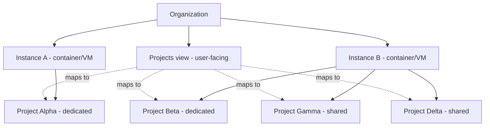

# Instance & project architecture

Librebase models data platforms at three levels: **organization**, **instance** (runtime), and **project** (logical workspace). This extends the Supabase-shaped console with an explicit shared-runtime option.

## Supabase comparison

| Supabase | Librebase |
|----------|-----------|
| Organization | Organization |
| Project (= isolated stack) | Project (logical workspace) |
| *(implicit hosted stack)* | **Instance** (container/VM running `lis` + lidb) |

Supabase Cloud treats each project as its own isolated Postgres + services stack. Librebase keeps that as the **dedicated** default and adds **shared** instances where multiple projects coexist on one runtime.

## Current implementation

Phase 1 Studio in `data-studio-ui/`:

| Concept | Status |
|---------|--------|
| Organization | Stub: `orgId` defaults to `"default"`; `OrgShell` sidebar |
| Instance | JSON store — id, name, orgId, dataDir, ports, status, deploymentMode |
| Project | JSON store — `instanceId`, `deploymentMode: dedicated \| shared` |
| Dedicated create | New project provisions new instance (1:1) |
| Shared create | Project wizard picks existing instance (N:1) |
| `launchProjectDb` | `scripts/lidb_engine.py` (`ensure` / `status`); `lis db start` when `LIDB_ROOT` set |
| Containers/VMs | Local process path only; Docker per-project compose planned (C3) |

Studio cloud flow: `/` projects list → `/projects/new` → `/projects/:id` → **Launch database** → Database / SQL / Settings tabs. `/instances` for runtime health and launch.

## Target model



### Dedicated (default)

- **1 instance : 1 project**
- New project provisions a new runtime (container, VM, or local `lis` process).
- Matches Supabase: separate data dir, ports, credentials, blast radius.

### Shared (advanced)

- **1 instance : N projects**
- User selects an existing instance when creating a project.
- Projects get distinct schema namespaces (or databases) inside one lidb embed.
- One launch/health target; lower infra cost for dev and internal teams.

## UI hierarchy

```
Organization
├── Projects          ← primary nav (Supabase-like)
│   └── [project] → Database | SQL | Settings
└── Instances         ← cloud/ops nav (launch, health, assignment)
    └── [instance] → linked projects, runtime status
```

**Create project** wizard:

1. Name, region (org context).
2. Runtime: **New instance** (default) or **Existing instance** (shared).
3. Launch / attach → open project console.

## Runtime mapping

| Surface | Dedicated | Shared |
|---------|-----------|--------|
| `LI_DATA_DIR` | Per instance | One dir per instance |
| Ports | Per instance | Per instance (shared API) |
| Studio scope | Per project | Per project (namespace routing) |
| `launchProjectDb` | Start instance if stopped | Start instance once; attach project namespace |

## Migration from today

1. Extract `Instance` entity from implicit 1:1 project binding (`projects-store.ts`).
2. Add `instanceId` + `deploymentMode: dedicated | shared` on projects.
3. Cloud control plane provisions containers/VMs; local keeps `lis db start` path.
4. Studio: Instances page + create-project runtime picker.

See `.cursor/rules/librebase-product.mdc` for agent constraints.

## Testing

Vitest unit tests live in `data-studio-ui/__tests__/` (instances-store, projects-store, url helpers). Target stack:

| Layer | Tool | Focus |
|-------|------|-------|
| Studio / bridge | Vitest + Testing Library (planned) | `project-runtime` launch flows, entitlement gates |
| lidb embed | pytest (planned) | `lidb_engine.py` lifecycle, health, degraded modes |
| E2E | Playwright (planned) | dedicated vs shared create flow, Instances view, honest health UI |

CI (planned): lint → Vitest + pytest on PR; Playwright on main or nightly.
