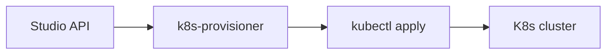

# Kubernetes runtime

Librebase Studio can provision instance runtimes on Kubernetes instead of local `lis db start`. The control plane lives in `data-studio-ui/lib/k8s-provisioner.ts`; manifests are generated in `k8s-manifests.ts` and applied with `kubectl`.

## Prerequisites

| Requirement | Purpose |
|-------------|---------|
| `kubectl` on PATH | Apply and status queries |
| `KUBECONFIG` (or default kube context) | Cluster credentials |
| Cluster with default StorageClass | PVC for `LI_DATA_DIR` |
| Runtime image (see below) | `lis` + lidb in pod |

Set Studio runtime target:

```powershell
$env:LIBREBASE_RUNTIME = "kubernetes"
$env:KUBECONFIG = "C:\path\to\kubeconfig"
cd data-studio-ui
npm run dev
```

Per-request override: pass `"runtime": "kubernetes"` on `POST /api/instances` or `POST /api/projects`.

## Architecture



### Dedicated (1 instance : 1 project)

- Namespace: `librebase-inst-<instanceId>`
- Full stack: PVC, ConfigMap, Secret, Deployment, Service
- Labels: `librebase.io/org`, `librebase.io/instance`, `librebase.io/deployment-mode=dedicated`

### Shared (1 instance : N projects)

- Namespace: `librebase-shared-<orgId>`
- One Deployment/PVC/Service per instance
- Each project gets a ConfigMap (`librebase-project-<projectId>`) with schema namespace metadata

## Health and honest degraded mode

- **Liveness:** exec `lidb_engine.py status` (same JSON contract as local `scripts/lidb_engine.py`)
- **Readiness:** TCP on API port
- If `kubectl cluster-info` fails → `degraded: true`, status `stopped` — Studio never shows fake green

## Container image

Placeholder until a published build exists:

```
ghcr.io/librebase-official/lidb-runtime:stub
```

Override: `LIBREBASE_K8S_IMAGE`. The image must ship `lidb_engine.py` at `/opt/librebase/scripts/lidb_engine.py`.

## Studio integration

| Action | Behavior |
|--------|----------|
| Create project + "Deploy to Kubernetes" | Creates instance with `runtimeTarget: kubernetes`, calls `provisionDedicatedInstance` |
| Shared project on K8s instance | `attachSharedProject` applies project ConfigMap |
| Launch instance/project | Re-applies manifests, then `getInstanceStatus` |
| `/instances` UI | Shows `runtimeTarget`, namespace, pod phase |
| `GET /api/instances/:id/status` | Local or K8s probe |

## Entitlements

K8s provisioning and launch paths include `TODO` entitlement gates (paid Studio/lidb). Wire plan/license checks before removing TODOs.

## Manual deploy (without Studio)

**Helm (dedicated):**

```powershell
helm install my-instance deploy/helm/librebase-instance `
  --set instanceId=inst_manual `
  --set orgId=default `
  --set deploymentMode=dedicated
```

**Raw manifests:** see `deploy/kubernetes/`.

## Local cluster quickstart (kind)

```powershell
kind create cluster --name librebase
$env:KUBECONFIG = "$env:USERPROFILE\.kube\config"
$env:LIBREBASE_RUNTIME = "kubernetes"
cd data-studio-ui
npm run dev
```

Create a project with **Deploy to Kubernetes** checked. Studio applies manifests; status stays degraded until a real runtime image is available.

### minikube

```powershell
minikube start
$env:KUBECONFIG = "$env:USERPROFILE\.kube\config"
# same Studio steps as kind
```

Optional: `kubectl port-forward -n librebase-inst-<id> svc/librebase-api 54320:54320` for local API access.

## CI

Vitest mocks `kubectl` — no cluster in GitHub Actions. Optional kind/minikube job can be added later; not required for merge.

## Related

- `docs/architecture-instances.md` — instance/project model
- `deploy/kubernetes/README.md` — manifest reference
- `data-studio-ui/lib/k8s-provisioner.ts` — provisioner API
