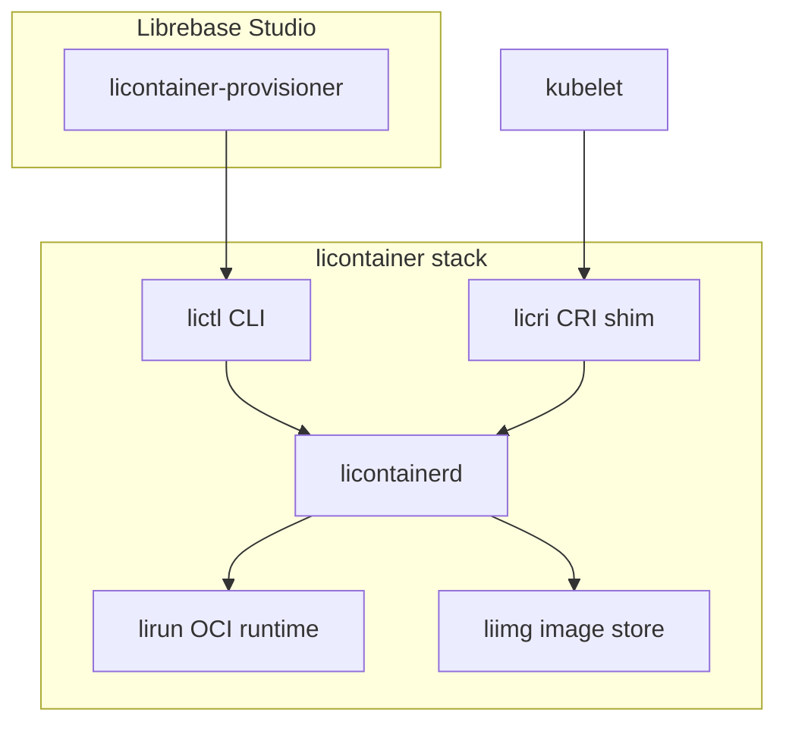

# licontainer — Li Container Engine

General-purpose OCI-compatible container engine for Librebase: lower memory footprint, stronger default security, and integration with Kubernetes and Studio.

## Architecture



| Component | Path | Role |
|-----------|------|------|
| `lirun` | `licontainer/lirun/` | OCI runtime: create/start/delete/kill/state |
| `licontainerd` | `licontainer/licontainerd/` | Daemon: images, containers, Unix socket JSON API |
| `lictl` | `licontainer/lictl/` | Docker-like CLI: pull, run, ps, stop |
| `liimg` | `licontainer/liimg/` | OCI layout pull/store, optional squashfs export |
| `licri` | `licontainer/licri/` | Kubernetes CRI v1 subset |
| `licontainer-proto` | `licontainer/licontainer-proto/` | Shared API types |

## OCI compliance matrix (v1)

| Spec operation | Status | Notes |
|----------------|--------|-------|
| `config.json` bundle | ✅ | process, root, mounts, linux namespaces, cgroups |
| `create` | ✅ | Linux only |
| `start` | ✅ | namespaces + pivot_root |
| `delete` | ✅ | `--force` for running |
| `kill` | ✅ | SIGTERM/SIGKILL |
| `state` | ✅ | JSON on stdout |
| checkpoint | ❌ | deferred |
| hooks (all types) | ❌ | deferred |
| events | ❌ | deferred |

## Security model

- **Rootless-by-default**: drop all capabilities; bundle may add `NET_BIND_SERVICE` etc.
- **Seccomp**: deny-all + syscall whitelist (libseccomp); skip with `LI_CONTAINER_SKIP_SECCOMP=1` in dev
- **No privileged API**: daemon rejects privileged containers (no `--privileged` in API)
- **Socket permissions**: `licontainerd.sock` and `licri.sock` created with mode `0600`
- **Entitlement gates**: `check_entitlement()` TODO before `PullImage` / `CreateContainer` for Librebase cloud
- **Optional signature verify**: set `LI_CONTAINER_REQUIRE_SIGNATURE=1` (future Cosign integration)

## Windows WSL2 bridge (v1)

Native Windows containers (HCS/runhcs) are **out of v1 scope**.

On Windows, `lictl` forwards to a WSL2 distro:

```powershell
# Install (creates LibrebaseContainer distro)
.\deploy\windows\install-licontainer-wsl.ps1

# Run via WSL bridge
lictl run hello-world
```

Environment:

| Variable | Default | Purpose |
|----------|---------|---------|
| `LI_CONTAINER_WSL_DISTRO` | `LibrebaseContainer` | WSL distro name |

## Building

```bash
cd licontainer
cargo build --release
cargo test
```

### Linux integration tests

Requires root or cgroup v2 write access:

```bash
export LI_CONTAINER_INTEGRATION=1
export LI_CONTAINER_SKIP_SECCOMP=1
cargo test -p lirun --test integration
```

### CI

GitHub Actions job `licontainer-build` on `ubuntu-latest` installs `libseccomp-dev`, builds all crates, runs unit tests. Integration tests run with `LI_CONTAINER_INTEGRATION=1` when cgroup permissions allow.

## Running lictl

```bash
# Start daemon (Linux / WSL2)
licontainerd --socket /run/licontainer/licontainerd.sock

# Pull and run
lictl pull ghcr.io/librebase-official/lidb-runtime:dev
lictl run --name mydb ghcr.io/librebase-official/lidb-runtime:dev
lictl ps
lictl stop <container-id>
```

Environment:

| Variable | Default | Purpose |
|----------|---------|---------|
| `LI_CONTAINER_SOCKET` | `/run/licontainer/licontainerd.sock` | Daemon socket |
| `LI_CONTAINER_STORE` | `/var/lib/licontainer` | Image/container store |
| `LI_CONTAINER_STATE_DIR` | `/run/licontainer/containers` | lirun state |
| `LI_CONTAINER_CGROUP_ROOT` | `/sys/fs/cgroup/licontainer` | cgroup v2 root |
| `LIRUN_BIN` | `lirun` | Runtime binary path |

## Kubernetes

```bash
# Node bootstrap
sudo deploy/kubernetes/node-bootstrap/install-licontainer.sh

# Apply RuntimeClass
kubectl apply -f deploy/kubernetes/runtime-class-licontainer.yaml

# Helm with licontainer runtime
helm install myinst deploy/helm/librebase-instance \
  --set containerRuntime=licontainer
```

Kubelet config: `container-runtime-endpoint=unix:///run/licontainer/licri.sock`

## Benchmarks

See `benchmarks/licontainer-vs-docker/README.md` for RSS and cold-start comparison scripts.

## Security checklist

- [ ] Containers run without CAP_SYS_ADMIN
- [ ] Seccomp profile active (`LI_CONTAINER_STRICT_SECCOMP=1` in prod)
- [ ] Root filesystem read-only where bundle specifies `readonly: true`
- [ ] cgroup v2 limits applied (pids.max default 256)
- [ ] Daemon socket mode 0600
- [ ] No privileged flag in daemon API
- [ ] Entitlement check before pull/create in cloud (TODO)

## lidb production image

Export lidb-runtime as OCI + squashfs:

```bash
scripts/export-lidb-oci-image.sh
```

Default K8s image: `ghcr.io/librebase-official/lidb-runtime:oci-squashfs` (see `k8s-manifests.ts`).
