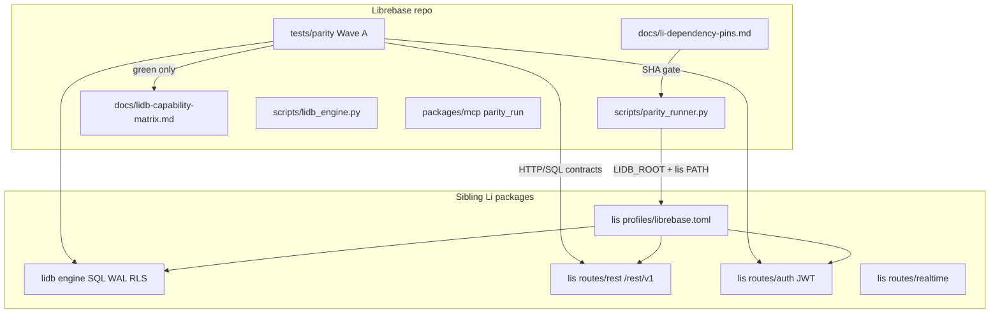

# Spec: Supabase parity (core vertical)

> Technical how-to-build from approved `requirements.md` + constitution (MIT for Librebase first-party; honest tests; edit Li packages in sibling checkouts).

## Approach (locked)

**Testing-first core vertical with in-repo Li package edits:** build an executable Wave A harness in Librebase that fails honestly until sibling **lidb** / **lis** (and opt-ins as needed) implement the contracts; implement those gaps in the Li checkouts; pin SHAs in Librebase; wire Studio to `lis db start --profile librebase`.  

**Why:** Pin-only tracking cannot create `/rest/v1` or RLS; registry `/v1/packages` is not Supabase REST; constitution forbids vendoring forks.

**Rejected:** (a) fake ✅ from markdown; (b) only documenting blockers without editing Li; (c) claiming registry CRUD as PostgREST parity; (d) blocking Wave A on Admin Python→Li rewrite.

## Architecture

### Component responsibilities

| Component | Repo | Responsibility |
|-----------|------|----------------|
| Wave A harness | librebase | P-SQL-01 … P-RLS-01 (+ soft P-RT-01) |
| `parity_runner.py` | librebase | Start stack or skip `no_lidb`; never greenwash stub |
| `li-dependency-pins.md` | librebase | SHA/path pins; harness requires ≥ |
| lidb native catalog / WAL / RLS eval | **li/lidb** | CREATE/ensure table, INSERT/SELECT, policy eval |
| lis `/rest/v1/{table}` | **li/lis** | New `routes/rest/` → lidb |
| lis auth JWT | **li/lis** | Keep `/v1/auth/*` MVP; align claims for RLS |
| `profiles/librebase.toml` | **li/lis** | WP-F: compose rest+auth+db for Librebase |
| Realtime | **li/lis** | Soft gate until PR ready |
| li-oauth / li-edge / li-httpd | siblings | Wave B / compose later — not Wave A blockers |

### Default sibling paths (this machine)

| Dep | Path | Audit SHA (2026-07-29) |
|-----|------|-------------------------|
| lidb | `C:\Users\Julian\Documents\Programming\li\lidb` | `39853cc` (`feat/wp-j-embed-session-reuse`) |
| lis | `C:\Users\Julian\Documents\Programming\li\lis` | `82da467` (`main`) |
| li-oauth | `...\li-oauth` | `92501c6` |
| li-edge | `...\li-edge` | `708a6fa` |
| li-httpd | `...\li\li-httpd` | `3b7472e` |

Env: `LIDB_ROOT`, `lis` on `PATH` (or `LIS_ROOT`). Prefer merge lidb feature work toward consumable main/tag for CI.

## Wave A contracts (API shape)

| ID | Protocol | Expected behavior | Primary Li edits |
|----|----------|-------------------|------------------|
| P-SQL-01 | SQL / embed CLI or HTTP SQL if exposed | Ensure table + INSERT + SELECT round-trip | `lidb/engine/native_catalog.cpp`, migrations, WAL path as needed |
| P-REST-01 | `GET/POST/PATCH/DELETE /rest/v1/{table}` + basic filters | Schema CRUD, not registry packages | **New** `lis/routes/rest/` |
| P-AUTH-01 | `POST /v1/auth/signup` + `/v1/auth/login` → JWT; Bearer accepted | HS256 session JWT MVP | `lis/routes/auth/*` |
| P-RLS-01 | Same REST/SQL as user A vs B | Cross-user row denied without claim | lidb policy eval + lis claim wiring |
| P-RT-01 | WS subscribe (soft) | Optional skip until realtime ready | `lis/routes/realtime/` |

**Auth path note:** Supabase GoTrue uses `/auth/v1`; linative MVP today is `/v1/auth/*`. Harness targets **lis `/v1/auth`** for Wave A; GoTrue path alias is deferred (document in matrix notes).

**SQL DDL note:** Native catalog lacks CREATE TABLE execution today. Wave A may satisfy P-SQL-01 via **migration/bootstrap ensure** of a fixture table plus INSERT/SELECT, then harden DDL as follow-up — DoD still requires create-or-ensure + DML round-trip.

## Librebase file touch list

| Path | Change |
|------|--------|
| `docs/li-dependency-pins.md` | New pins + blockers |
| `docs/lidb-capability-matrix.md` | Re-audit; ✅ only after harness green |
| `docs/parity-plan.md` | Point at SDD + Li edit rule |
| `tests/parity/` | Wave A tests + fixtures |
| `scripts/parity_runner.py` | Orchestrate / skip |
| `.github/workflows/parity.yml` | Optional job |
| `scripts/lidb_engine.py` | Prefer lis profile `librebase`; stub only if `LIDB_RUNTIME_MODE=dev` |
| `data-studio-ui/lib/project-runtime.ts` | Same runtime policy |
| `packages/mcp/src/server.js` | `parity_run`, harness status; fill missing tools |
| `packages/cli/src/index.js` | `parity` / pins |

## Li package file touch list (first cuts)

| Package | Files |
|---------|-------|
| lis | `profiles/librebase.toml`; `routes/rest/` (new); wire dispatcher; OpenAPI snippet |
| lis | `routes/auth/handlers.py`, `jwt_util.py`, store — claims for RLS |
| lidb | `engine/native_catalog.cpp` (ensure/DDL); RLS eval hook; un-SKIP security tests where ready |
| lidb | `migrations/` fixture for parity users/items + RLS policies |
| lis | realtime only if P-RT-01 un-skipped |

## License honesty

- **Librebase new first-party:** MIT (constitution).
- **lidb / lis / li-*** today:** GPL-3.0-or-later. Relicensing Li packages is **out of this Wave A scope** unless a separate product decision is made; adopters of Librebase product code get MIT; Li engine deps remain GPL until changed upstream.

## Research notes

- Supabase GA core: Postgres, PostgREST `/rest/v1`, Auth+RLS, Realtime, Storage, Edge, Studio, JS client.
- `supabase-js` `sdk-compliance.yaml` is for later SDK Wave B.
- Local audit 2026-07-29: lis has registry REST + auth MVP; no `/rest/v1`; lidb INSERT/SELECT yes, CREATE/RLS eval incomplete; no `profiles/librebase.toml`.

## Risks & honesty

| Risk | Mitigation |
|------|------------|
| Stub opens ports → looks “up” | Health must label `dev`/degraded; harness skip ≠ pass |
| lidb on feature branch | Pin SHA; track merge to main; harness documents required branch |
| Scope creep to full GoTrue/S3 | Out of scope; Wave B only after Wave A green |
| Cross-repo commits | Separate commits/PRs per repo; Librebase pin bump after Li lands |
| GPL Li + MIT Librebase | Document dual-license stack for adopters |

## Grill-me plan loop (resolved)

### Iteration 1 — Ambiguities
- **Edit Li packages?** Yes (user). Paths: `Programming/li/{lidb,lis,li-httpd}`, `Programming/{li-oauth,li-edge}`.
- **Auth URL:** Wave A = `/v1/auth/*` (existing), not GoTrue `/auth/v1` yet.
- **P-SQL-01 DDL:** allow ensure-via-migration for MVP; still require DML round-trip.

### Iteration 2 — Tradeoffs / execution
- **REST:** new `routes/rest/` not reuse registry packages API.
- **Pins:** SHA + path; empty lip deps until registry supports lidb/lis as packages.
- **Smallest useful:** pins doc + harness (fail/skip) + `librebase.toml` scaffold + stub REST failing tests → then implement lis rest + lidb RLS.

### Iteration 3 — Failure / validation / rollback
- **Default CI:** skip Wave A without Li (exit 0 skipped).
- **Nightly/optional:** fail on Wave A red when `LIDB_ROOT` set.
- **Rollback:** revert Li PRs independently; Librebase pin rollback; stub path remains via `LIDB_RUNTIME_MODE=dev`.
- **Validation:** named IDs green; matrix ✅ only then; MCP `parity_run` returns structured JSON.

## AC → spec mapping

| AC | Spec element |
|----|----------------|
| AC-1.1–1.3 | Matrix re-audit + pins; ✅ gated by harness |
| AC-2.1–2.4 | Wave A contracts table + `tests/parity` + soft P-RT-01 |
| AC-3.1–3.3 | Default CI skip vs `parity.yml` |
| AC-4.1–4.3 | `lidb_engine` / `project-runtime` + `librebase` profile |
| AC-5.1–5.3 | MCP/CLI parity tools |
| AC-6.1–6.4 | Li touch list + process; Admin rewrite non-blocker |

## Definition of done (MVP)

1. Pins + re-audited matrix committed in Librebase.
2. Harness exists: skip without Li; fail/pass with Li.
3. `lis/profiles/librebase.toml` exists; `/rest/v1` route module started (may still fail until CRUD complete).
4. At least P-AUTH-01 runnable against existing auth MVP when stack up.
5. Tasks for remaining P-SQL/P-REST/P-RLS Li work ordered and tracked.
6. No matrix ✅ without green named test.
