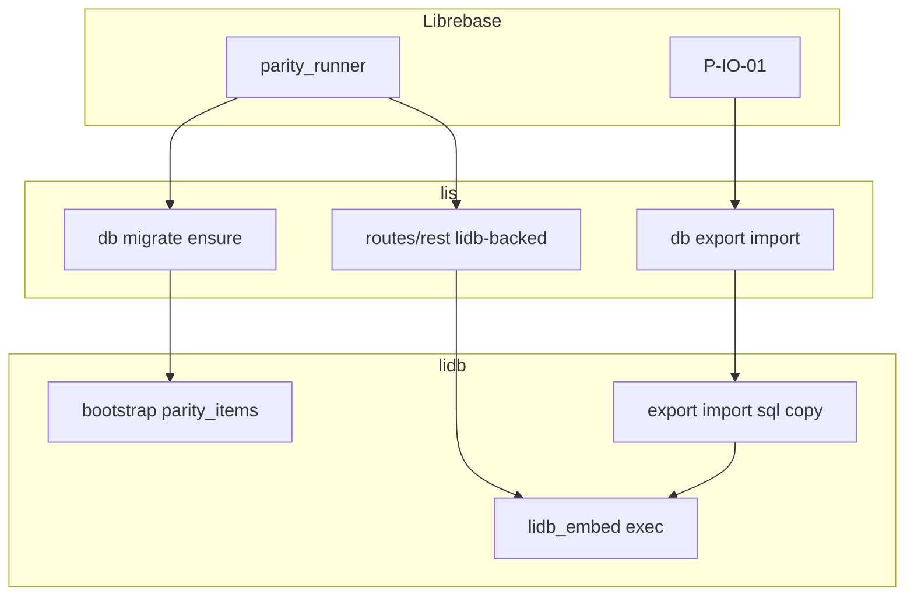

# Spec: Wave A native testing + import/export

> Technical how-to-build from approved `requirements.md` + [`CONSTITUTION.md`](../../CONSTITUTION.md).
> Extends [`../supabase-parity/`](../supabase-parity/) — does not replace Wave A HTTP contracts.

## Approach (locked)

Close Wave A by **editing sibling lidb/lis**, proving with Librebase `parity_runner`, then add **export/import (SQL + COPY)** on `lidb_embed` with lis CLI wrappers. Defer lit until Li APIs exist.

**Why:** Pin-only tracking cannot ensure tables or replace in-memory REST; constitution forbids fake ✅ and vendor forks.

**Rejected:** (a) claiming native Li lit coverage over C++ engine; (b) pg_dump custom format in v1; (c) MySQL converters; (d) blocking on CREATE TABLE full DDL before bootstrap ensure.

## Architecture



## File touch list

| Repo | Paths |
|------|--------|
| lidb | `engine/native_catalog.cpp` (bootstrap `parity_items`); `engine/cli/embed_main.cpp` (export/import); tests + smoke; docs honesty |
| lis | `routes/rest/handlers.py`; migrate/export/import CLI; `profiles/librebase.toml`; `docs/cli-db.md` |
| librebase | `tests/parity/contracts.py` (`P-IO-01`); matrix/pins; this SDD dir; `supabase-parity/analyze.md` |

## APIs

```text
lidb_embed migrate <data-dir>          # ensures bootstrap incl. parity_items
lidb_embed export <data-dir> --format sql|copy --tables t1,t2 -o path
lidb_embed import <data-dir> --format sql|copy -i path
lis db migrate
lis db export ...
lis db import ...
```

Allowlist v1: `parity_items` (+ registry tables only if SELECT/INSERT already work).

**Ensure honesty:** MVP uses **bootstrap hardcode** in `NativeCatalog::apply_bootstrap_schema` (does not parse `migrations/011_parity_items.sql`). SQL-file apply is follow-up.

## Grill-me resolutions

1. Bootstrap ensure before full SQL migrator; Wave A RLS may stay lis-enforced with matrix note.
2. REST replaces `_STORE` for `parity_items` only; other tables fail closed.
3. Validation = live parity_runner + export round-trip; CI skip without Li.

## AC → spec mapping

| AC | Spec element |
|----|----------------|
| AC-1.* | Live runner + matrix/pins |
| AC-2.* | Bootstrap + smoke/pytest |
| AC-3.* | lidb-backed rest + profile |
| AC-4.* | export/import CLI + P-IO-01 |
| AC-5.* | Honesty docs / no fake lit claims |

## Risks

| Risk | Mitigation |
|------|------------|
| Bootstrap ≠ SQL migrator | Document in AC-2.3 / matrix notes |
| REST durability misunderstood | Test against catalog; document restart |
| Export confused with backup | Docs: backup = heap tar; export = SQL/COPY |
| Claiming native Li | AC-5 |

## Definition of done (MVP)

1. SDD artifacts committed under this directory.
2. Live Wave A required IDs pass with Li configured.
3. `lidb_embed export/import` (sql) round-trips allowlisted table; lis wrappers documented.
4. No lit / “native Li tested” claims for C++-only surfaces.
