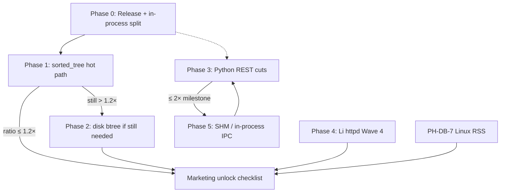

# Engine / runtime performance plan — close remaining Librebase gaps

**Date:** 2026-08-05  
**Status:** **implemented this session** (Phase 0–1 + Phase 3.1–3.2); CI promote + Linux RSS still open  
**Branch:** `feat/p5-oltp-index-impl-detect` (librebase) · lidb `feat/p5-sorted-tree-index` · lis `feat/deepen-phase1-refresh-buckets`  
**Related:** [`benchmarks/oltp-compare/MARKETING_UNLOCK.md`](../../benchmarks/oltp-compare/MARKETING_UNLOCK.md)

## Goal

Close the open paths that keep marketing **LOCKED**:

| Gap | Current (2026-08-05 after Phase 0–1 / 3.1–3.2) | Unlock target |
|-----|-----------------------------------------------|---------------|
| `range_scan_name_prefix` | median **0.36×** Postgres P95 (0.29–0.37×) on **Release** | ≤ **1.2×** then promote to CI hard gate — **local DoD met** |
| HTTP REST vs PostgREST | median max **~0.60×** (soft PASS) | soft-green ≤ **1.2×** — **local DoD met**; CI hard-gate optional |
| PH-DB-7 lean RSS | Windows advisory **5.6 MB PASS**; Linux VmRSS pending | citable Linux green **or** forever “64 MB aim” |

Core SQL gate is already **PASS** (`point_lookup_with_index` ~0.19–0.25× via `embed_execjson` + `PersistentEmbedProcess`). Do not regress it.

---

## Baseline (committed artifacts)

| Artifact | Key numbers |
|----------|-------------|
| [`results/range-scan-streak.json`](../../benchmarks/oltp-compare/results/range-scan-streak.json) | lidb pin `d7f5cb5`, `index_impl=sorted_tree`, median ratio **1.9424** |
| [`results/http-streak.json`](../../benchmarks/oltp-compare/results/http-streak.json) | lis pin `f94f4ce`, median max ratio **4.37×**; postfix session reuse still ~4.3× |
| MARKETING_UNLOCK | Status **LOCKED**; core streak done; range + HTTP + Linux RSS still open |

**Harness honesty notes already recorded:**

- Range reps used **Debug** `lidb_embed` on Windows — re-measure Release before claiming structural limits.
- Scenario SQL: `WHERE name LIKE 'lookup-%' LIMIT 50` on 10k rows (`benchmarks/oltp-compare/README.md`).
- HTTP gap root cause: **Python REST surface** (stdlib HTTP + auth), not embed spawn after `PersistentEmbedProcess` in `lidb_store._exec_json`.

---

## Code reality (accurate starting point)

### lidb — `sorted_tree` today

- Secondary: nested `std::map` → key → `vector<row_index>`  
  (`NativeCatalog::secondary_` in `lidb/engine/include/lidb/native_catalog.hpp`).
- Prefix path: `lower_bound(prefix)` + `compare(0, n, prefix)` break + `LIMIT` early exit in `emit_row`  
  (`native_catalog.cpp` ~838–852).
- Advertised as `index_impl=sorted_tree` (migration_intent / session ready / `probe_index_impl`) — **not** disk B-tree.
- `NativeRow::cols` is also `std::map<string,string>` — every emit pays map copy / lookup cost.
- Heap rows live in `vector<NativeRow>`; index stores **row indices**, so range scan = ordered index walk + random heap touches.

### lis — REST / embed IPC today

- Non-RLS: `PersistentEmbedProcess` (long-lived `lidb_embed session`, NDJSON line protocol) via `_exec_json`.
- RLS (`LI_RLS_ENGINE=1`): `_session_exec` still **spawns a fresh `session` subprocess per call** (stdin batch → quit) — must not stay on the hot path if RLS is on for HTTP benches.
- Serve path: Python `ThreadingHTTPServer` / registry handler stack; Wave 4 `packages/lis-rest` is allowlist + lic gate only; **Li HTTP serve blocked on lic P0 httpd** ([Wave 4 release note](https://github.com/li-langverse/lis) / `lis/docs/release-notes/2026-08-03-wave-4-lis-rest.md`).

### Absolute latency budget for ≤1.2×

From range-scan-rep-1: Postgres P95 ≈ **0.39 ms** → 1.2× budget ≈ **0.47 ms**. lidb P95 ≈ **0.76 ms**. Need ~**38%** wall-time cut (≈ **1.6×** engine speedup on this scenario), **or** prove Debug/build/IPC artifacts inflate the ratio and re-baseline Release first.

---

## Research findings

### A) In-memory ordered indexes & prefix range scans

| Source | Relevance |
|--------|-----------|
| [Leis, Kemper, Neumann — Adaptive Radix Tree (ART), ICDE 2013](https://www.db.in.tum.de/~leis/papers/ART.pdf) · [IEEE](https://doi.org/10.1109/ICDE.2013.6544812) | Cache-conscious radix tree; O(k) lookup; **sorted order → prefix + range**; better than unbalanced BST/`std::map` on modern CPUs. |
| [Wong et al. — TLB misses & ART (DaMoN 2015)](https://event.cwi.nl/damon2015/papers/damon15-wong.pdf) | ART is strong but TLB/pointer chasing still matter; structure choice ≠ free lunch. |
| [Li et al. — FB+-tree, PVLDB 18](https://vldb.org/pvldb/vol18/p1579-li.pdf) · [arXiv](https://arxiv.org/html/2503.23397v1) | **Tries win point lookup; B+/hybrid win dense range iteration** (linked leaves, less pointer chase). YCSB-E style range favors balanced leaf-linked designs. |
| [Rao & Ross — Cache-conscious B+-trees (SIGMOD 2000)](https://doi.org/10.1145/335191.335449) | Classic CSB+/cache-line packing — relevant if we grow a true in-memory B+ leaf array. |
| MySQL / engine practice: rewrite `LIKE 'p%'` → `[p, successor(p))` range | Avoid per-key LIKE re-check; tight upper bound ([example writeup](https://dev.to/rebooter_s/mysql-like-optimization-100x-faster-queries-2flm)). |
| TiDB #65813 — prefix index + `ORDER BY/LIMIT` early stop | Push LIMIT into ordered scan ([issue](https://github.com/pingcap/tidb/issues/65813)) — lidb already early-exits LIMIT; ensure index walk never materializes past LIMIT. |

**Implication for lidb:** `std::map` (red-black, poor locality) is the wrong long-term secondary for range. Prefer **(1)** flat sorted vector / abseil-style btree map for dense string keys, **(2)** ART if prefix-heavy point+prefix mix, **(3)** leaf-linked in-memory B+ if ranges dominate. Do **not** jump to disk B-tree until in-memory + Release still miss 1.2×.

### B) Embed / OLTP IPC latency

| Source | Relevance |
|--------|-----------|
| [Zhou et al. — OLTP Through the Looking Glass 16 Years Later (CIDR 2025)](https://www.vldb.org/cidrdb/papers/2025/p17-zhou.pdf) | **Communication is the new bottleneck.** Isolation via TCP ≫ domain sockets ≫ **shared-memory + polling**; in-process / no-isolation still fastest. |
| [Wisc — Evaluation of IPC Mechanisms](https://pages.cs.wisc.edu/~adityav/Evaluation_of_Inter_Process_Communication_Mechanisms.pdf) | Shared memory lowest latency (esp. large msgs); pipes next; TCP worst. Sync is the hard part. |
| Industry NDJSON session patterns | Easy + debuggable; fine when query ≫ framing; wasteful when query ~0.2–0.7 ms (our range/point regime). |

**Implication:** Session NDJSON already unlocked point-lookup gate. Next IPC wins are for **multi-request REST** and **RLS**: keep one process, avoid JSON row materialization, then shared-memory frames or **in-process** embed (C-API / pybind / Li FFI) for lis. Shared memory before rewriting the whole SQL engine.

### C) Python REST vs PostgREST / Li-native HTTP

| Source | Relevance |
|--------|-----------|
| [PostgREST architecture](https://postgrest.org/en/latest/explanations/architecture.html) | Schema cache → plan AST → SQL; pool borrow only at execute; compiled Haskell + libpq. |
| [PostgREST connection pool](https://docs.postgrest.org/en/stable/references/connection_pool.html) | Dynamic pool; prepared statements; external poolers often **hurt**. |
| [Hasql](https://github.com/nikita-volkov/hasql) | Thin, typed libpq driver used by PostgREST — low per-request CPU. |
| FastAPI/asyncpg vs PostgREST discussions | Framework rarely the whole gap; **pool, serialization, middleware, DB proximity** dominate ([Markaicode comparison](https://markaicode.com/benchmarks/fastapi-vs-supabase-benchmark/)). |
| lis Wave 4 | Li REST package builds; **HTTP serve blocked on lic P0 httpd** (`li-httpd` M1 not implemented). |

**Implication:** Soft-green ≤1.2× with pure stdlib Python is **unlikely**. Short-term: cut Python per-request work + embed pool + binary wire. Medium: Li httpd. Do not wait on lic P0 to start Python wins — but do not promise PostgREST parity from Python alone.

### D) Medium-term disk / mmap ordered index

| Source | Relevance |
|--------|-----------|
| [LMDB](http://www.lmdb.tech/doc/lmdb0.9/) · [docs](https://lmdb.readthedocs.io/en/latest/) | mmap B+tree, zero-copy cursor `set_range`, excellent read/range; secondary = separate named DBs. |
| RocksDB / LSM | Write-optimized; range scans pay compaction/merge — poor fit for lean RSS + simple secondary. |

**Implication:** If heap must leave RAM or restarts must keep index without rebuild, prefer **mmap B+ (LMDB-shaped or native page B+)** over LSM. Keep `index_impl` honesty: flip wire label to `btree` only when on-disk pages exist.

---

## Implementation plan

### Phase 0 — Measurement hygiene (0.5–1 day) — **do first**

1. Rebuild `lidb_embed` **Release** (and RelWithDebInfo) on the same Windows host; re-run 3× `range_scan_name_prefix`.
2. Add harness fields: `build_type` (Debug/Release), `embed_ipc`, compiler flags.
3. Microbench inside embed (no IPC): same SQL via in-process `EmbeddedDatabase::exec_parameterized` to split **engine vs NDJSON**.
4. Optional Linux cross-check early (same seed) so we do not optimize Windows-Debug-only artifacts.

**Exit:** Written note in `results/` whether gap is ≥1.5× on Release in-process. If Release in-process already ≤1.2×, promote Release CI binary and skip heavy structure work.

### Phase 1 — Immediate lidb range_scan path (3–8 days) — **hit ≤1.2×**

Ordered by expected ROI / risk:

| # | Change | Why | Est. |
|---|--------|-----|------|
| 1.1 | **Successor upper-bound** for prefix: compute `hi = prefix_successor(prefix)`; iterate `[lo, hi)` without per-key `compare` | Matches MySQL-style range rewrite; cheaper exit | 0.5 d |
| 1.2 | **Avoid `NativeRow` map copy on emit**: project into result with reserved `vector` / flat cols; for `SELECT *` move or ref-count; stop deep-copying `std::map` | Emit currently copies maps for every of up to 50 rows | 1–2 d |
| 1.3 | Replace secondary `std::map` with **`absl::btree_map` or sorted `vector` + `lower_bound`** (string keys, append-heavy rebuild OK) | Cache-friendly ordered container; ART optional later | 2–3 d |
| 1.4 | **Covering / fat leaf**: store needed column bytes (or full row offset + hot cols) in secondary leaf to cut random heap chase | Classic secondary-index win for `LIMIT 50` | 1–2 d |
| 1.5 | Prefetch next leaf / batch row materialization; reserve `result.rows` | Small constant factors | 0.5 d |
| 1.6 | Keep point-lookup path on same structure; re-run **core** gate every change | No marketing regress | continuous |

**DoD Phase 1:** 3-rep streak `range_scan_name_prefix` ≤ **1.2×** on Release; core still PASS; `index_impl` still honestly `sorted_tree` (or `sorted_btree_mem` if label updates — document in release note).

**If still >1.2× after 1.1–1.4:** prototype ART secondary (equality + prefix) behind flag; measure vs btree_map. Prefer FB+/leaf-linked only if profiler shows iteration pointer-chase dominates.

### Phase 2 — Medium: persistent / disk ordered index (2–4 weeks) — **only if needed**

Trigger: Phase 1 Release still >1.2× **or** product needs durable secondary without full rebuild / larger-than-RAM tables.

| Step | Work |
|------|------|
| 2.1 | Spec page format (4 KiB), leaf key+rowid, sibling links; WAL co-design with existing snapshot |
| 2.2 | Implement read path `lower_bound` + range; rebuild from heap on migrate vN |
| 2.3 | Optional: embed **LMDB-shaped** mmap store for secondary only (GPL/license check vs librebase) — or pure C++ pages to avoid deps |
| 2.4 | Advertise `index_impl=btree`; update MARKETING_UNLOCK / harness honesty |
| 2.5 | Lean RSS re-check (PH-DB-7) — pages must not blow 64 MB aim |

**Non-goals:** full Postgres btree_gin/gist; LSM; multi-column prefix parity beyond allowlist.

### Phase 3 — HTTP: short-term lis/Python wins (1–2 weeks parallel)

Target: shrink **~4–6× → ≤2×** first (honest soft progress), then chase ≤1.2× if feasible.

| # | Change | Notes | Est. |
|---|--------|-------|------|
| 3.1 | **RLS path:** route `_session_exec` through `PersistentEmbedProcess` + `set_claims` NDJSON cmds (no spawn/quit per request) | Critical if benches enable RLS | 1 d |
| 3.2 | **Embed session pool** (N processes or N in-proc handles) behind ThreadingHTTPServer | Avoid global lock serialization | 1–2 d |
| 3.3 | Cut handler overhead: cache JWT verify; avoid double `get` after update; smaller JSON encode | Profile with `py-spy` / cProfile on `rest_get_eq_name` | 1–2 d |
| 3.4 | Replace stdlib server with **uvicorn/hypercorn** (or waitress) behind feature flag for librebase profile | Keep lean default if RSS matters | 1–2 d |
| 3.5 | Binary / msgpack row frame from embed (optional) to skip JSON parse of rows | Helps when DB ≪ HTTP still | 2–3 d |
| 3.6 | Document soft-gate progress in `http-streak.json`; do **not** claim soft-green until ≤1.2× | Honesty | — |

**Realistic expectation:** Python + IPC may soft-green only if PostgREST side is also “cold” or if we move DB in-process. Plan for **≤2× soft milestone**, then Phase 4 for true parity.

### Phase 4 — Wave 4 Li-native HTTP (blocked; track, don’t fake)

| Dependency | Action |
|------------|--------|
| lic P0 bytes / async / http → `li-httpd` M1 | Track upstream; no fake “Li-served” matrix flip |
| When httpd ready | Port allowlisted `/rest/v1` handlers from `packages/lis-rest` to live serve; keep Python fallback until `LI_REST_REQUIRE_LI=1` green |
| Embed | Prefer in-process lidb or SHM RPC from Li runtime (align Phase 5) |

**Est.:** calendar-bound to lic; engineering in lis ~1–2 weeks after httpd usable.

### Phase 5 — Embed IPC next generation (1–3 weeks, after Phase 1)

| Option | When | Effort |
|--------|------|--------|
| A. Keep NDJSON session (status quo) | Enough for SQL gate | done |
| B. Shared-memory ring + seqlock/polling | REST still IPC-bound after Python cuts | 1–2 w |
| C. In-process library (`lidb_embed` as `.so`/`.dll` + C API; Python/`li` FFI) | Best latency; CIDR “no isolation” | 1–3 w |
| D. Unix domain socket + length-prefixed binary | Middle ground; portable | 1 w |

Sequence: **C for lis-local**, **B if multi-language clients must stay out-of-process**. Measure with Phase 0 microbench harness.

### Phase 6 — Measurement / CI gates

| Gate | Action | When |
|------|--------|------|
| Core SQL | Keep nightly hard gate (`--scenarios core`, ≤1.2×) | already |
| Range scan | Add **diagnostic job** publishing ratio; promote to hard gate after **2 consecutive nights ≤1.2×** | after Phase 1 DoD |
| HTTP | Keep soft gate; publish `http-latest.json`; hard-gate only after 2 stable soft-green nights | after Phase 3/4 |
| PH-DB-7 | Finish Linux VmRSS CI (lidb MR !5 / footprint-gate.yml); cite in MARKETING_UNLOCK | parallel |
| Build type | Fail or WARN if CI uses Debug embed for gated scenarios | Phase 0 |
| Labels | Require `index_impl` in artifacts; reject marketing copy claiming disk btree while `sorted_tree` | continuous |

Harness additions (librebase `benchmarks/oltp-compare`):

- `--build-type` / auto-detect from binary path.
- Optional `--ipc inprocess|session|shm` once Phase 5 lands.
- `check_gate.py`: `--promote-range-scan` flag for temporary hard include.

---

## Sequencing (critical path)

**Parallel tracks:**

1. **Marketing-critical:** P0 → P1 → (P2 if needed) + Linux RSS.  
2. **Product REST:** P3 → P5 → P4 (P4 calendar-blocked).  
3. Never block P1 on lic httpd.

---

## Effort summary

| Phase | Calendar | Eng-days (approx.) | Owner surface |
|-------|----------|--------------------|---------------|
| 0 Measurement | 1–2 d | 1 | librebase harness + lidb build |
| 1 Range hot path | 1–1.5 w | 3–8 | lidb `native_catalog` |
| 2 Disk btree | 2–4 w | 10–20 | lidb engine |
| 3 Python REST | 1–2 w | 5–10 | lis `routes/rest` |
| 4 Li HTTP | blocked + 1–2 w | 5–10 | lis + lic |
| 5 IPC next | 1–3 w | 5–15 | lidb embed + lis |
| CI/gates | ongoing | 2–4 | librebase oltp-compare |

**Cheapest path to marketing unlock row 3 (range):** Phase 0 + 1.1–1.4.  
**Cheapest path to HTTP soft progress:** 3.1–3.3 (may not reach 1.2×).  
**Path to HTTP soft-green:** likely Phase 5C and/or Phase 4 — budget honesty accordingly.

---

## Top 3 recommended next engineering moves

1. **Re-baseline range_scan on Release + in-process microbench** (Phase 0) — current ~1.94× includes Debug `lidb_embed`; do not design P2 disk btree until this is known.  
2. **lidb Phase 1.1–1.3:** prefix successor bounds + kill `std::map` row copies + replace secondary `std::map` with btree_map/sorted vector — highest probability path to ≤1.2× without persistence rewrite.  
3. **lis Phase 3.1–3.2:** persistent session for RLS + session pool under HTTP — removes known spawn/lock tax before chasing Li httpd; re-run HTTP 3-rep soft streak.

---

## Risks & honesty

- Optimizing Debug-only numbers → false “done”.  
- ART helps prefix lookup but may **hurt** dense range vs leaf-linked B+ (FB+-tree / ART literature) — measure.  
- Claiming disk btree while still `std::map` → MARKETING_UNLOCK violation.  
- Python REST soft-green may be **unreachable** without in-process/Li HTTP — keep optional gate language.  
- Shared-memory IPC complexity / corruption risk — prefer in-process for single-host lis+lidb.  
- Lean RSS: fatter indexes must stay under PH-DB-7 story (measure after Phase 1/2).

---

## Out of scope (this plan)

- Implementing the engine changes in the PR that lands this document.  
- Changing marketing copy to UNLOCKED.  
- Full PostgREST operator surface / RPC / views.  
- Rewriting Postgres comparison harness fairness beyond documented modes.

---

## Citation index (URLs / papers)

1. https://www.db.in.tum.de/~leis/papers/ART.pdf — Adaptive Radix Tree (ICDE 2013)  
2. https://doi.org/10.1109/ICDE.2013.6544812 — ART IEEE record  
3. https://event.cwi.nl/damon2015/papers/damon15-wong.pdf — ART TLB study  
4. https://vldb.org/pvldb/vol18/p1579-li.pdf — FB+-tree (PVLDB)  
5. https://arxiv.org/html/2503.23397v1 — FB+-tree HTML  
6. https://www.vldb.org/cidrdb/papers/2025/p17-zhou.pdf — OLTP Looking Glass 2025 (IPC bottleneck)  
7. https://pages.cs.wisc.edu/~adityav/Evaluation_of_Inter_Process_Communication_Mechanisms.pdf — IPC evaluation  
8. https://postgrest.org/en/latest/explanations/architecture.html — PostgREST architecture  
9. https://docs.postgrest.org/en/stable/references/connection_pool.html — PostgREST pool  
10. http://www.lmdb.tech/doc/lmdb0.9/ — LMDB mmap B+tree  
11. https://github.com/pingcap/tidb/issues/65813 — prefix index + LIMIT short-circuit  
12. https://dev.to/rebooter_s/mysql-like-optimization-100x-faster-queries-2flm — LIKE → range rewrite practice  

---

## Acceptance for *this* deliverable

- [x] Research (web + academic) captured above  
- [x] Concrete phased plan with estimates + sequencing  
- [x] File under `docs/superpowers/plans/`  
- [x] **Phase 0:** Release re-baseline (`build_type` in harness; Debug was the 1.94× artifact)  
- [x] **Phase 1.1–1.3:** prefix successor + emit projection / covering key + `SortedKeyIndex` (sorted vector) — range median **0.36×**  
- [x] **Phase 3.1–3.2:** persistent `set_claims` + embed session pool — HTTP soft median max **0.60×**  
- [ ] Phase 2 disk btree — **not needed** (range already ≤1.2× on Release)  
- [ ] Linux VmRSS / PH-DB-7 citable green — still open  
- [ ] CI promote range_scan hard gate + HTTP hard gate (2 nights) — follow-up  
- [x] Commit + push on implementation branches (librebase / lidb / lis)
